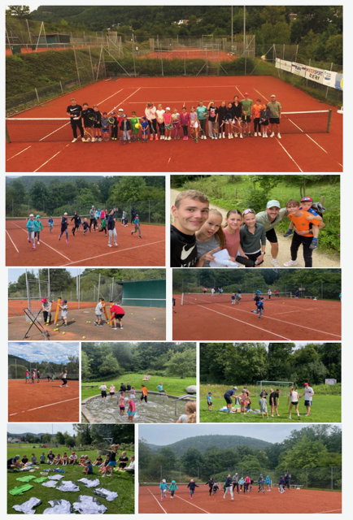

+++
title = 'Jugend-Tenniscamp beim TC Lautlingen'
date = 2025-08-28T08:03:14+01:00
draft = false
featured_image = 'images/Tenniscamp.png'
categories = 'News'
tags = 'News 2025'
+++

In der ersten Sommerferienwoche stand beim TC Lautlingen wieder alles im
Zeichen des Tennissports: Das Jugend-Tenniscamp bot drei abwechslungsreiche
Tage voller Training, Spaß und gemeinsamer Erlebnisse.

Nach der Begrüßung startete das Camp mit einem gemeinsamen Warm-up, bei dem
Koordination, Schnelligkeit und Teamgeist im Mittelpunkt standen. In spannenden
Staffelspielen traten die Jugendlichen in Teams gegeneinander an und kamen direkt
in Camp-Stimmung. Anschließend folgten die ersten Trainingseinheiten, die je nach
Spielstärke in Klein- und Großgruppen aufgeteilt waren. Technikübungen,
Ballmaschinen-Training, Rundlauf und verschiedene Spielformen sorgten für
Abwechslung und forderten alle Teilnehmenden auf ihrem individuellen Niveau.

Neben intensiven Tennis-Einheiten kam auch der Spaß nicht zu kurz: In den Pausen
wurde gemeinsam gegessen, gebastelt, gespielt oder einfach entspannt. Das
Mittagessen und die Verpflegung trugen zu einer tollen Camp-Atmosphäre bei.

Auf dem Programm des zweiten Camptages standen unter anderem Volley-,
Aufschlag- und Schmetterball-Training, kleine Wettkämpfe sowie ein internes
Turnier. Auch ein gemeinsamer Lauf und verschiedene Koordinationsübungen
gehörten dazu – hier waren Durchhaltevermögen und Teamgeist gefragt.

Am dritten Tag standen nochmals Turnierspiele auf dem Plan. Nach einer kurzen
Kuchenpause ging es in die Finalrunden, bevor das Camp mit einer
gemeinsamen Wanderung und Grillen seinen gemütlichen Abschluss fand. Bei
der Siegerehrung erhielten alle Teilnehmenden Urkunden, kleine Preise und tolle
Erinnerungen an drei erlebnisreiche Tage.

Das Jugend-Tenniscamp war auch in diesem Jahr ein voller Erfolg. Die Mischung aus
Training, Spiel, Wettkampf und Gemeinschaft machte das Camp zu einem Highlight
der Sommerferien – und zeigte einmal mehr, wie viel Spaß Tennis im Team machen
kann.

